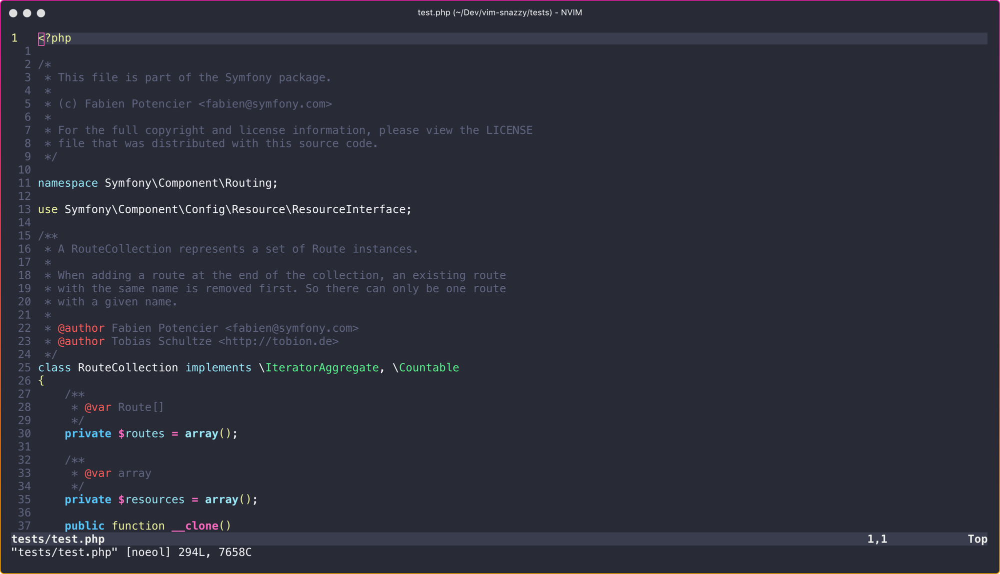
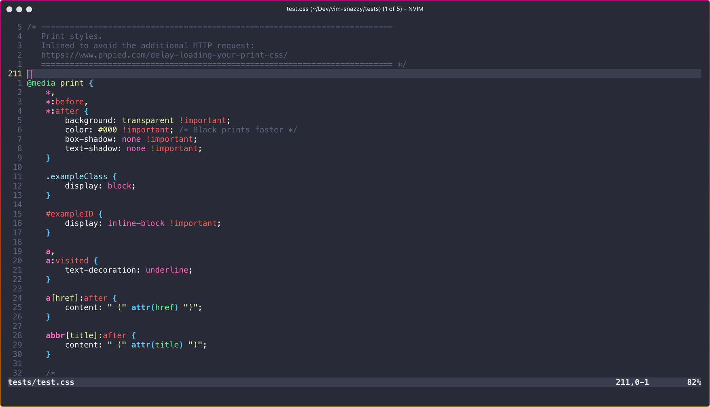
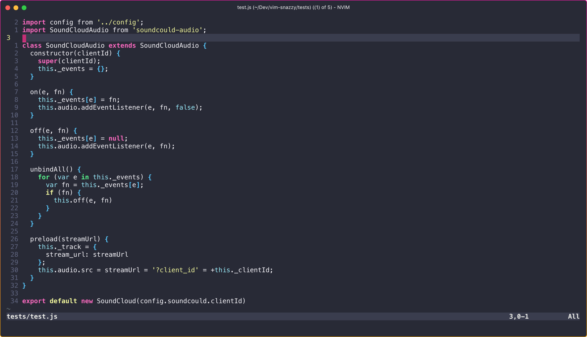
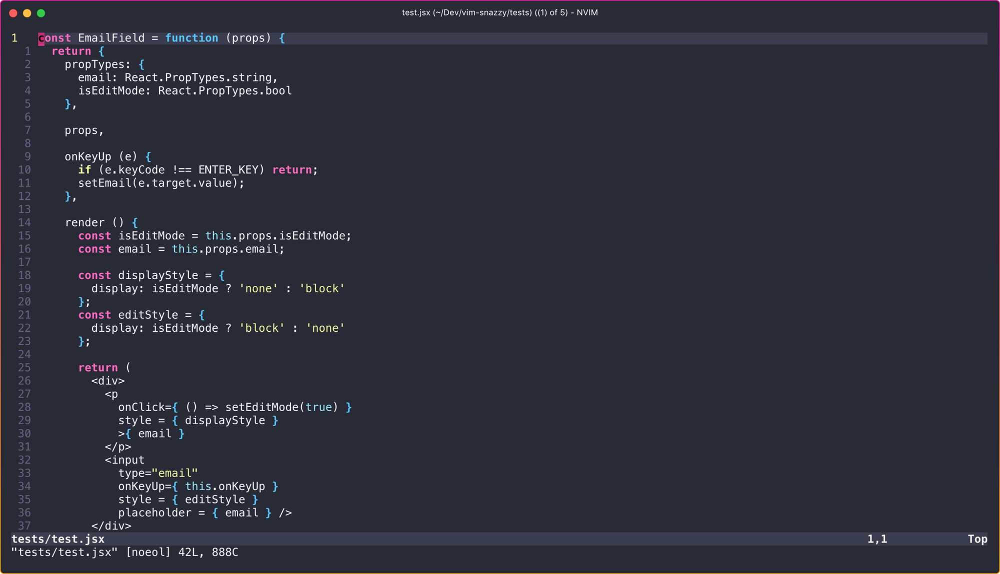

# vim-snazzy

> Elegant vim theme with bright colors. Based on [hyper-snazzy](https://github.com/sindresorhus/hyper-snazzy/) by [Sindre Sorhus](https://sindresorhus.com).

This is still an early build, I'll be implementing better language support as I use this more myself.

All feedback, comments, and PRs welcome.

## Screenshots

### PHP


### CSS


### JS


### JSX


## Installation

### Vundle or vim-plug
To install using [Vundle](https://github.com/VundleVim/Vundle.vim) or [vim-plug](https://github.com/junegunn/vim-plug)
add one of the following line to your .vimrc

```vim
" vundle
Plugin 'connorholyday/vim-snazzy'

" vim-plug
Plug 'connorholyday/vim-snazzy'
```

### Pathogen
To install using [Pathogen](https://github.com/tpope/vim-pathogen) run the following command
```
cd ~/.vim/bundle && git clone git@github.com:connorholyday/vim-snazzy.git
```

### Manually
To install manually download https://raw.githubusercontent.com/connorholyday/vim-snazzy/master/colors/snazzy.vim

Place the file in `~/.vim/colors/` or `<your-vim-dir>\vimfiles\colors\` on Windows.

For Neovim place the file in `~/.config/nvim/colors/`

## Running

To load the color scheme run
```
:colorscheme snazzy
```

To always use the snazzy color scheme add the following line to your .vimrc
```
colorscheme snazzy
```

## Contributing
There are only a couple of things you need to know if you want to help out:
1. All of the code lives inside `colors/snazzy.vim`
2. The variables for the palette are set at the top
3. `:exe` is used so we can use the variables via string concatenation
4. If you're adding a new section, try to keep it to a new block and title it with a comment

There is a `test/` directory for language files that you can use to test out the highlighting, feel free to improve them or include your language of choice.

Here's a list of helpful plugins and articles to get you started:
- [HiLinkTrace](http://vim.wikia.com/wiki/Identify_the_syntax_highlighting_group_used_at_the_cursor) - Used to tell you the syntax group for your highlight rule
- [hexHighlight](https://www.vim.org/scripts/script.php?script_id=2937) - (gVim) Shows you the colours that the hex-values represent
- [Vimcasts: Creating colorschemes for vim](http://vimcasts.org/episodes/creating-colorschemes-for-vim/)
- [Working with vim colorschemes](https://jordanelver.co.uk/blog/2015/05/27/working-with-vim-colorschemes/)


## Related

- [iterm2-snazzy](https://github.com/sindresorhus/iterm2-snazzy) - iTerm2 version
- [terminal-snazzy](https://github.com/sindresorhus/terminal-snazzy) - Terminal version
- [konsole-snazzy](https://github.com/miedzinski/konsole-snazzy) - Konsole version
- [vscode-snazzy](https://github.com/Tyriar/vscode-snazzy) - VS Code version
- [emacs-snazzy](https://github.com/weijiangan/emacs-snazzy) - Emacs version
- [termite-snazzy](https://github.com/kbobrowski/termite-snazzy) - Termite version
- [deepin-snazzy](https://github.com/xxczaki/deepin-snazzy) - Linux Deepin terminal version


## TODO

Complete language supports with Kitchen Sink test files

- [ ] HTML
- [ ] CSS
- [ ] PHP
- [ ] JS
- [ ] JSX
- [ ] Markdown

Vim features

- [ ] ALE
- [ ] Netrw
- [ ] NerdTree
- [ ] Light mode
- [ ] Lightline
- [ ] Airline


## License

MIT © [Connor Holyday](https://holyday.me)
